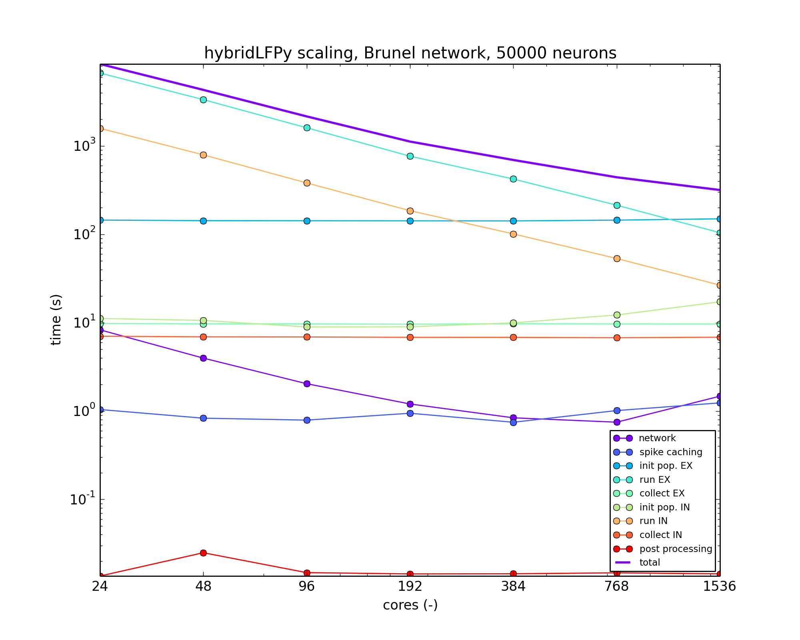

.. testdata documentation master file, created by
   sphinx-quickstart on Wed Apr 11 11:19:04 2012.
   You can adapt this file completely to your liking, but it should at least
   contain the root `toctree` directive.

Welcome to the documentation of **hybridLFPy**!
===============================================

.. include:: ../README.md

Notes on performance
--------------------

The present version of ``hybridLFPy`` may facilitate on a trivial parallelism
as the contribution of each single-cell LFP can be computed independently. 
However, this does not imply that the present implementation code is highly
optimized for speed. In particular, initializing the multicompartment neuron
populations do not as much benefit from increasing the MPI pool size, as
exemplified by a benchmark based on the Brunel-network example scaled up to
50,000 neurons and with simplified neuron morphologies. 

    
    Scaling example with ``hybridLFPy`` based on a Brunel-like network with 50,000 neurons, running on the JURECA cluster at the Juelich Supercomputing Centre (JSC), Juelich Research Centre, Germany.

========================
Module :mod:`hybridLFPy`
========================

.. automodule:: hybridLFPy
    :members:
    :show-inheritance:
    :undoc-members:
    
    
    class :class:`CachedNetwork`
    ============================
    .. autoclass:: hybridLFPy.CachedNetwork
        :members:
        :show-inheritance:
        :undoc-members:
    

    class :class:`CachedNoiseNetwork`
    =================================
    .. autoclass:: hybridLFPy.CachedNoiseNetwork
        :members:
        :show-inheritance:
        :undoc-members:

    class :class:`CachedFixedSpikesNetwork`
    =======================================
    .. autoclass:: hybridLFPy.CachedFixedSpikesNetwork
        :members:
        :show-inheritance:
        :undoc-members:

    
    class :class:`PopulationSuper`
    ==============================
    .. autoclass:: hybridLFPy.PopulationSuper
        :members:
        :show-inheritance:
        :undoc-members:
    
    
    class :class:`Population`
    =========================
    .. autoclass:: hybridLFPy.Population
        :members:
        :show-inheritance:
        :undoc-members:
    
    
    class :class:`PostProcess`
    ==========================
    .. autoclass:: hybridLFPy.PostProcess
        :members:
        :show-inheritance:
        :undoc-members:
    
    
    class :class:`GDF`
    ==================
    .. autoclass:: hybridLFPy.GDF
        :members:
        :show-inheritance:
        :undoc-members:

    
    submodule :mod:`helpers`
    ========================
    .. automodule:: hybridLFPy.helpers
        :members:
        :undoc-members:
    
    
    submodule :mod:`csd`
    ====================
    .. automodule:: hybridLFPy.csd
        :members:
        :undoc-members:

    submodulue :mod:`testing`
    =========================
    .. autofunction:: hybridLFPy.test

Indices and tables
==================

* :ref:`genindex`
* :ref:`modindex`
* :ref:`search`

